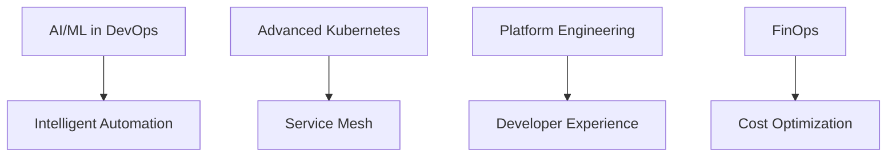

<div align="center">
  
</div>

<div align="center">
  
</div>

<div align="center">
  
  
</div>

<br>

<div align="center">
  
  <h2>🎯 Engineering Excellence Through Automation</h2>
</div>

<p align="center">
  <em>"Transforming complex infrastructure challenges into elegant, automated solutions"</em><br>
  <strong>🏗️ Architect of Resilient Systems | 🚀 Performance Optimization Specialist | 🔬 Innovation Catalyst</strong>
</p>

<table>
<tr>
<td width="50%">

### 🎖️ Professional Expertise

```yaml
role: Senior DevOps Engineer @ Nielsen
experience: 4.5+ years
specialization:
  - Cloud Architecture & Cost Optimization
  - Site Reliability Engineering
  - Backend Systems Design
  - Infrastructure Automation

philosophy: |
  "Code is poetry, infrastructure is art,
   and automation is the bridge between them."
```

### 🏆 Impact Metrics
- 💰 **95% AWS Cost Reduction** through intelligent ALB consolidation
- 🤖 **60% Support Ticket Reduction** via AI-powered documentation
- ⚡ **500+ Concurrent Processes** in data migration orchestration
- 📈 **50% MTTR Improvement** through observability excellence
- 👥 **Led 6-Engineer DevOps Team** establishing deployment standards

</td>
<td width="50%">

<div align="center">
  
</div>

### 🎯 Current Mission

```typescript
interface DevOpsEngineer {
  currentFocus: string[];
  learningPath: string[];
  interests: string[];
}

const shashank: DevOpsEngineer = {
  currentFocus: [
    "AI/ML in DevOps Automation",
    "Advanced Kubernetes Patterns",
    "Platform Engineering",
    "FinOps & Cost Optimization"
  ],
  learningPath: [
    "Service Mesh Architecture",
    "Chaos Engineering",
    "GitOps Workflows"
  ],
  interests: [
    "🎸 Guitar", "🌍 Travel", "📚 Tech Blogs"
  ]
};
```

</td>
</tr>
</table>

<div align="center">
  <h3>🌐 Let's Connect & Collaborate</h3>
  <a href="https://linkedin.com/in/shashank-shukla-b84b7a162">
    
  </a>
  <a href="mailto:shashank.shukla1202@gmail.com">
    
  </a>
  <a href="https://shashank-devops-hub.vercel.app">
    
  </a>
  <a href="https://github.com/sh-shukla">
    
  </a>
</div>

<br>

<div align="center">
  
  <h2>🛠️ Technology Arsenal & Expertise Matrix</h2>
  
</div>

### ☁️ Cloud & Infrastructure
   

### 🚀 DevOps & Automation
    

### 🔄 CI/CD & Version Control
   

### 📊 Monitoring & Observability
   

### 💻 Programming & Backend
    

### 🗄️ Databases & Message Queues
    

### 🌐 Web Servers & Load Balancers
 

<br>


<div align="center">
  
  <h2>🏆 Engineering Impact & Achievements</h2>
  
</div>

<table>
<tr>
<td width="33%" align="center">

### 💰 Cost Optimization


**95% AWS Cost Reduction**

*Intelligent ALB consolidation strategy*

</td>
<td width="33%" align="center">

### 🤖 AI-Powered Solutions


**60% Support Reduction**

*AI-driven documentation platform*

</td>
<td width="33%" align="center">

### ⚡ High-Performance Systems


**500+ Concurrent Processes**

*Scalable data migration orchestration*

</td>
</tr>
<tr>
<td width="33%" align="center">

### 🚀 Deployment Excellence


**40% Time Reduction**

*Helm chart template optimization*

</td>
<td width="33%" align="center">

### 📊 Observability Mastery


**50% MTTR Improvement**

*Comprehensive monitoring stack*

</td>
<td width="33%" align="center">

### 👥 Leadership Impact


**6-Engineer Team Lead**

*Deployment standards & best practices*

</td>
</tr>
</table>

<br>

<div align="center">
  
  <h2>🎓 Professional Certifications & Credentials</h2>
  
</div>

<div align="center">
  <table>
    <tr>
      <td align="center">
        <br>
        <br>
        <sub><strong>Certified Kubernetes Administrator</strong></sub>
      </td>
      <td align="center">
        <br>
        <br>
        <sub><strong>Terraform Associate Certified</strong></sub>
      </td>
    </tr>
  </table>
</div>

<br>

<div align="center">
  
  <h2>🚀 Innovation Roadmap & Future Vision</h2>
  
</div>

<table>
<tr>
<td width="50%">

### 🔬 Research & Development


</td>
<td width="50%">

### 🎯 Strategic Initiatives
- 🧠 **AI-Driven Infrastructure** - Predictive scaling & self-healing systems
- 🕸️ **Service Mesh Mastery** - Istio, Linkerd, and advanced networking
- 🏗️ **Platform Engineering** - Internal developer platforms & golden paths
- 💰 **FinOps Excellence** - Cloud economics & resource optimization
- 🔐 **Zero Trust Security** - Policy-as-code & compliance automation

</td>
</tr>
</table>

<div align="center">
  
</div>

<div align="center">
  
  <br><br>
  
  <br><br>
  <sub><strong>💡 "In the symphony of technology, DevOps is the conductor that harmonizes development and operations into a masterpiece of efficiency."</strong></sub>
</div>
